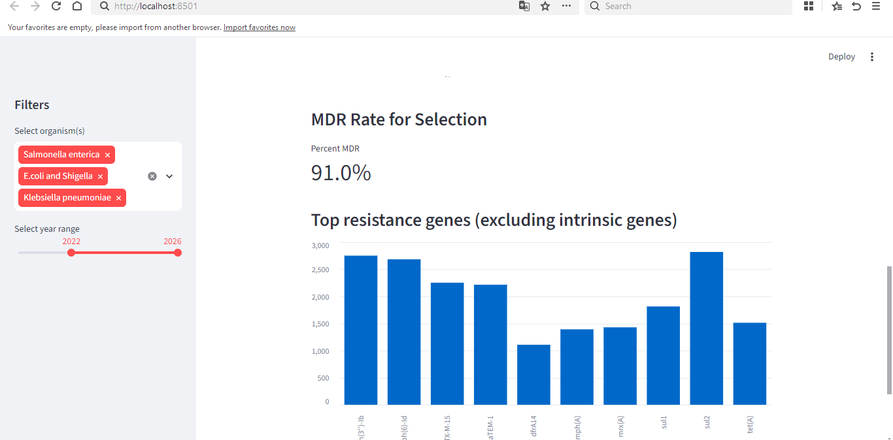

# Antimicrobial Resistance Profiling & Prediction — Kenya

## Overview
This project analyzes publicly available genomic surveillance data for three clinically important bacteria — *E. coli*/*Shigella*, *Klebsiella pneumoniae*, and *Salmonella enterica* — collected in Kenya, to understand patterns of antimicrobial resistance (AMR) and test whether multi-drug resistant (MDR) status can be predicted from sample metadata alone.

Antimicrobial resistance is one of the most pressing global health challenges, and AI-assisted genomic surveillance is an active area of research (aligned with initiatives like WHO's GLASS program). This project applies that approach at a smaller scale, using real public data.

## Data source
- **Database:** NCBI Pathogen Detection (Isolates Browser)
- **Filters applied:** Organism = E.coli and Shigella / Klebsiella pneumoniae / Salmonella enterica, Location = Kenya, Isolation type = Clinical
- **Total isolates:** 4,086 (E.coli and Shigella: 2,569 · Klebsiella pneumoniae: 1,064 · Salmonella enterica: 453)
- **Fields used:** Organism group, Location, Create date, Isolation source, AMR genotypes

## Method
1. **Exploratory analysis** — cleaned and profiled the dataset, examined isolation sources, and tracked reporting trends over time.
2. **Resistance profiling** — parsed the `AMR genotypes` field into individual genes, separating species-specific intrinsic genes (always present, uninformative) from acquired resistance genes.
3. **MDR labeling** — mapped acquired genes to antibiotic drug classes (beta-lactams, aminoglycosides, sulfonamides, trimethoprim, tetracyclines, phenicols, fluoroquinolones, colistin) and labeled any isolate resistant to 3+ classes as Multi-Drug Resistant (MDR), per WHO's definition.
4. **Predictive modeling** — trained a Random Forest classifier to predict MDR status using only metadata (organism, isolation source, collection year) — deliberately excluding the resistance genes themselves, since MDR was derived directly from them.
5. **Gene co-occurrence network** — built a network showing which acquired resistance genes frequently appear together within the same isolate.
6. **Interactive dashboard** — built a Streamlit app allowing live filtering by organism and year range, showing isolate counts, MDR rate, and top resistance genes for the selected subset.

## Key findings

**1. Uneven surveillance over time.** Reported isolates were minimal in 2020 and 2023, then spiked sharply in 2025-2026 — most likely reflecting when sequencing capacity/funding was active, not a true change in infection rates.

**2. A Salmonella Typhi surveillance signal.** A subset of Salmonella isolates were linked to "Kibera" (a Nairobi neighborhood) with `serotype=Typhi`, indicating part of this dataset reflects genomic surveillance of typhoid in a specific, well-documented public health context.

**3. Extremely high, but organism-dependent, MDR burden.**
- Overall: **87.1%** of isolates (3,560 of 4,086) are classified as MDR.
- Klebsiella pneumoniae: **94.5%** MDR
- E.coli and Shigella: **91.4%** MDR
- Salmonella enterica: **45.5%** MDR

Klebsiella and E. coli show near-universal MDR, consistent with their global reputation as major ESBL/MDR reservoirs. Salmonella's lower rate likely reflects the dominance of the Typhi subset, though rising fluoroquinolone resistance in typhoid remains a recognized concern globally.

**4. Metadata alone is a weak predictor of MDR status.** A Random Forest model trained on organism, isolation source, and year achieved 89% accuracy — but this was almost entirely driven by organism identity (45% of feature importance), and the model performed poorly at identifying the minority non-MDR class (33% recall). This indicates that *which bacteria you have* matters far more to predicting MDR than *where or when* the sample was collected — resistance is conferred by the genes themselves, not sampling context.

**5. Resistance genes cluster together, suggesting plasmid-driven spread.** The gene co-occurrence network revealed that genes conferring resistance to entirely different drug classes (beta-lactams, sulfonamides, aminoglycosides, tetracyclines, trimethoprim, macrolides) frequently co-occur in the same isolates. This is the classic signature of a multi-drug-resistance plasmid — a single mobile genetic element carrying resistance to many antibiotic classes at once, which can spread between bacteria in one transfer event. This finding also helps explain #4: resistance often arrives as a pre-packaged bundle via plasmid transfer, rather than accumulating gradually in ways tied to sample location or time.

## Limitations
- This is genomic *surveillance* data, reflecting where and when sequencing happened — not necessarily a representative sample of true clinical AMR burden.
- MDR status is inferred from gene presence, which is a proxy; gene presence does not always guarantee phenotypic (expressed) resistance.
- The sharp rise in isolates over time likely reflects growing sequencing capacity, not a genuine epidemiological trend.
- The predictive model intentionally used only metadata, not genomic features, to test a specific question (can *context* predict resistance) — a model using actual genomic data would likely perform very differently.

## Running the dashboard
This dashboard runs locally on your machine. To try it:
```
pip install pandas scikit-learn networkx streamlit matplotlib
python -m streamlit run dashboard.py
```
This opens the app in your browser at `http://localhost:8501`, where you can filter by organism and year range to explore isolate counts, MDR rate, and top resistance genes live.



## Files in this repository
- `amr_multi_organism_kenya.csv` — original downloaded dataset from NCBI
- `processed_data.csv` — cleaned dataset with parsed genes, drug classes, and MDR labels
- `eda.py` — full analysis script: cleaning, gene parsing, MDR labeling, modeling, and network construction
- `dashboard.py` — interactive Streamlit dashboard
- `chart_organism_trends.png` — isolates per year, by organism
- `gene_network.png` — resistance gene co-occurrence network
- `dashboard_screenshot.png` — screenshot of the live dashboard

## Tools used
Python, pandas, scikit-learn, networkx, matplotlib, Streamlit
